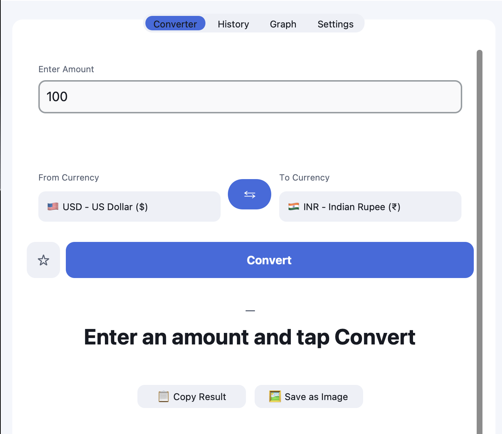
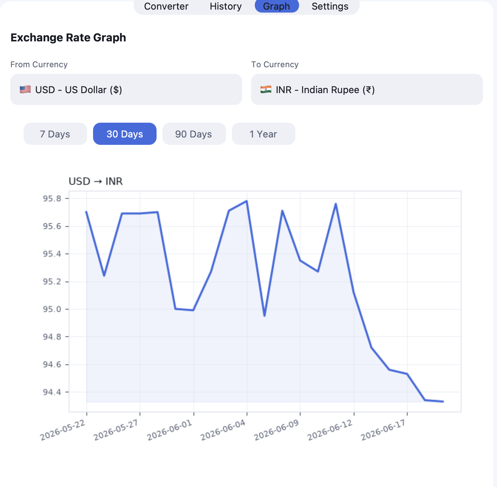
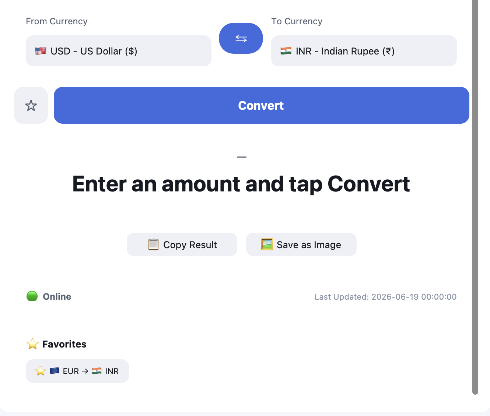

# 🌍 Global Currency Converter Pro

A modern, feature-rich desktop currency converter built with **Python** and **CustomTkinter**. It provides live exchange rates, historical charts, conversion history, favorites, exchange rate alerts, offline caching, and multi-language support in a sleek dark-themed interface.

---

## ✨ Features

### 💱 Currency Conversion
- Convert between 20+ international currencies
- Live exchange rates powered by Frankfurter API
- Accurate conversion engine with validation
- Currency symbols and flags

### 📈 Historical Exchange Rate Charts
- Interactive historical rate visualization
- Embedded Matplotlib charts
- Track currency performance over time

### ⭐ Favorites System
- Save frequently used currency pairs
- Quick access from the dashboard
- Stored locally for convenience

### 🔔 Exchange Rate Alerts
- Set custom upper/lower thresholds
- Receive notifications when rates cross targets
- Automatic monitoring during refresh cycles

### 📊 Conversion History
- CSV-backed conversion history
- Search and sort previous conversions
- Export history to CSV and PDF

### 🌐 Multi-Language Support
- English
- Spanish
- French
- Hindi

### ⚡ Additional Features
- Auto-refresh exchange rates
- Searchable currency dropdowns
- Calculator keypad
- Copy conversion results
- Save results as images
- Mini floating currency widget
- Offline cache support

---

## 🖥️ Screenshots

### Main Converter


### Historical Charts


### Favorites System


### Exchange Rate Alerts


> Add your screenshots inside `assets/screenshots/`

---

## 🚀 Installation

### Clone Repository

```bash
git clone https://github.com/teja2519/GlobalCurrencyConverterPro.git
cd GlobalCurrencyConverterPro-1.1
```

### Install Dependencies

```bash
pip install -r requirements.txt
```

### Run Application

```bash
python main.py
```

---

## 📦 Requirements

- Python 3.9+
- CustomTkinter
- Requests
- Pandas
- Matplotlib
- ReportLab
- Pillow

---

## 🏗️ Project Structure

```text
GlobalCurrencyConverterPro/
├── main.py
├── requirements.txt
├── build.spec
├── api/
├── ui/
├── data/
├── utils/
└── assets/
```

---

## 🔄 Offline Support

The application automatically caches the latest exchange rates.

If the API or internet connection becomes unavailable:

- 🟢 Live Data → Real-time rates
- 🟡 Cached Data → Previously stored rates
- 🔴 Offline → Graceful fallback mode

The application never freezes while fetching data because all API calls run in background threads.

---

## 🛠️ Build Executable

### Windows

```bash
pip install pyinstaller
pyinstaller build.spec
```

A standalone executable will be generated in:

```text
dist/
```

---

## 🔗 API Source

Exchange rates are provided by:

Frankfurter API

https://www.frankfurter.app/

---


## 📄 License

This project is licensed under the MIT License.

---

⭐ If you like this project, consider giving it a star.
